# Find Venue - Full Stack Web Application

A full-stack web application for discovering and managing venues with location-based search, user authentication, and comment functionality.

## 🚀 Live Demo

| Application | URL |
|-------------|-----|
| **Frontend (React + Vite)** | [https://find-venue-fneb.vercel.app](https://find-venue-fneb.vercel.app) |
| **Backend API (Node.js + Express)** | [https://find-venue.vercel.app](https://find-venue.vercel.app) |

## 📋 Table of Contents

- [Project Overview](#project-overview)
- [Features](#features)
- [Technology Stack](#technology-stack)
- [Project Structure](#project-structure)
- [API Documentation](#api-documentation)
- [Postman Testing](#postman-testing)
- [Installation & Setup](#installation--setup)
- [Environment Variables](#environment-variables)
- [License](#license)

## 🎯 Project Overview

Find Venue is a location-based venue discovery platform that allows users to:
- Search for nearby venues based on geographic coordinates
- View detailed information about venues including ratings, menus, and operating hours
- Add, update, and delete venues (admin functionality)
- Leave comments and reviews on venues
- User authentication with JWT tokens
- Admin panel for venue management

## ✨ Features

### User Features
- 🔐 **User Authentication**: Secure signup and login with JWT
- 📍 **Location-based Search**: Find venues near specific coordinates
- ⭐ **Ratings & Reviews**: View venue ratings and read/write comments
- 🕒 **Operating Hours**: Check venue opening and closing times
- 🍽️ **Menu Display**: Browse venue menus
- 📱 **Responsive Design**: Works seamlessly on desktop and mobile devices

### Admin Features
- ➕ **Add Venues**: Create new venue listings
- ✏️ **Edit Venues**: Update existing venue information
- 🗑️ **Delete Venues**: Remove venues from the database
- 📝 **Manage Comments**: Full CRUD operations on comments

### Security Features
- Protected routes with authentication middleware
- Password hashing with bcrypt
- JWT-based authentication
- Role-based access control (User/Admin)
- Automatic logout on inactivity

## 🛠️ Technology Stack

### Frontend
- **Framework**: React 19.2.0
- **Build Tool**: Vite 7.2.4
- **State Management**: Redux Toolkit 2.10.1
- **Routing**: React Router 7.9.6
- **HTTP Client**: Axios 1.13.2
- **Styling**: Bootstrap, Custom CSS
- **Authentication**: JWT Decode 4.0.0

### Backend
- **Runtime**: Node.js
- **Framework**: Express 4.21.2
- **Database**: MongoDB
- **ODM**: Mongoose 9.0.0
- **Authentication**: Passport.js, Passport-JWT, bcryptjs
- **Security**: JSON Web Tokens (jsonwebtoken)
- **Environment**: dotenv

## 📁 Project Structure

```
find_venue/
├── backend/
│   ├── app.js                                    # Express application setup
│   ├── package.json                              # Backend dependencies
│   ├── vercel.json                               # Vercel deployment config
│   ├── Recep Arslan.postman_collection.json     # API testing collection
│   ├── app_api/
│   │   ├── config/
│   │   │   └── passport.js                       # Passport JWT strategy
│   │   ├── controller/
│   │   │   ├── AuthController.js                 # Authentication logic
│   │   │   ├── CommentController.js              # Comment CRUD operations
│   │   │   └── VenueController.js                # Venue CRUD operations
│   │   ├── middleware/
│   │   │   └── auth.js                           # JWT authentication middleware
│   │   ├── models/
│   │   │   ├── db.js                             # Database connection
│   │   │   ├── user.js                           # User schema
│   │   │   └── venue.js                          # Venue schema
│   │   └── routes/
│   │       ├── AuthRoutes.js                     # Auth endpoints
│   │       ├── CommentRoutes.js                  # Comment endpoints
│   │       └── VenueRoutes.js                    # Venue endpoints
│   ├── bin/
│   │   └── www                                   # Server startup script
│   ├── insert_update/
│   │   ├── insert.mongodb                        # Database seed scripts
│   │   └── update.mongodb                        # Database update scripts
│   ├── public/
│   │   └── index.html                            # API documentation page
│   └── tests/                                    # Postman test screenshots
│
└── frontend/
    ├── index.html                                # Entry HTML
    ├── package.json                              # Frontend dependencies
    ├── vite.config.js                            # Vite configuration
    ├── vercel.json                               # Vercel deployment config
    ├── src/
    │   ├── App.jsx                               # Main application component
    │   ├── main.jsx                              # Application entry point
    │   ├── components/
    │   │   ├── About.jsx                         # About page
    │   │   ├── AddComment.jsx                    # Add comment form
    │   │   ├── AddVenue.jsx                      # Add venue form
    │   │   ├── AdminPanel.jsx                    # Admin dashboard
    │   │   ├── AdminProtectedRoute.jsx           # Admin route guard
    │   │   ├── AuthInitializer.jsx               # Auth state initializer
    │   │   ├── AuthProtectedRoute.jsx            # Auth route guard
    │   │   ├── Comment.jsx                       # Comment component
    │   │   ├── CommentList.jsx                   # Comment list display
    │   │   ├── Footer.jsx                        # Footer component
    │   │   ├── Header.jsx                        # Header component
    │   │   ├── Home.jsx                          # Home page
    │   │   ├── HourList.jsx                      # Operating hours display
    │   │   ├── InputWithLabel.jsx                # Reusable input component
    │   │   ├── Login.jsx                         # Login form
    │   │   ├── Logout.jsx                        # Logout component
    │   │   ├── Menu.jsx                          # Menu display
    │   │   ├── Modal.jsx                         # Modal component
    │   │   ├── NavBar.jsx                        # Navigation bar
    │   │   ├── PageNotFound.jsx                  # 404 page
    │   │   ├── Rating.jsx                        # Rating display
    │   │   ├── Signup.jsx                        # Signup form
    │   │   ├── Template.jsx                      # Layout template
    │   │   ├── UpdateComment.jsx                 # Update comment form
    │   │   ├── UpdateVenue.jsx                   # Update venue form
    │   │   ├── UserProtectedRoute.jsx            # User route guard
    │   │   ├── Venue.jsx                         # Venue card component
    │   │   ├── VenueDetail.jsx                   # Venue details page
    │   │   └── VenueList.jsx                     # Venue list display
    │   ├── hooks/
    │   │   └── useInactivityLogout.jsx           # Inactivity logout hook
    │   ├── redux/
    │   │   ├── reducer.jsx                       # Redux reducers
    │   │   └── store.jsx                         # Redux store configuration
    │   └── services/
    │       ├── http-common.jsx                   # Axios configuration
    │       ├── Utils.jsx                         # Utility functions
    │       └── VenueDataService.jsx              # API service layer
    └── public/
        └── javascripts/
            ├── bootstrap/                        # Bootstrap JS
            └── jquery/                           # jQuery library
```

---
## 🔌 API Endpoints

### Authentication

| Method | Endpoint | Description | Auth Required |
|--------|----------|-------------|---------------|
| `POST` | `/api/signup` | Register a new user | ❌ |
| `POST` | `/api/login` | Login and get JWT token | ❌ |

### Venues

| Method | Endpoint | Description | Auth Required |
|--------|----------|-------------|---------------|
| `GET` | `/api/venues?lat={lat}&long={long}` | Get venues by location | ❌ |
| `GET` | `/api/venues/:venueid` | Get venue details | ❌ |
| `GET` | `/api/admin` | Get all venues (admin) | ✅ Admin |
| `POST` | `/api/venues` | Create a new venue | ✅ Admin |
| `PUT` | `/api/venues/:venueid` | Update a venue | ✅ Admin |
| `DELETE` | `/api/venues/:venueid` | Delete a venue | ✅ Admin |

### Comments

| Method | Endpoint | Description | Auth Required |
|--------|----------|-------------|---------------|
| `GET` | `/api/venues/:venueid/comments/:commentid` | Get a comment | ❌ |
| `POST` | `/api/venues/:venueid/comments` | Add a comment | ✅ User |
| `PUT` | `/api/venues/:venueid/comments/:commentid` | Update a comment | ✅ Admin |
| `DELETE` | `/api/venues/:venueid/comments/:commentid` | Delete a comment | ✅ Admin |

---

## 🧪 API Testing (Postman)

The API has been thoroughly tested using Postman. You can find the test collection in the repository:

📁 **Collection File:** [`backend/Recep Arslan.postman_collection.json`](backend/Recep%20Arslan.postman_collection.json)

### Test Results

#### Authentication Tests
| Test | Screenshot |
|------|------------|
| Signup User | 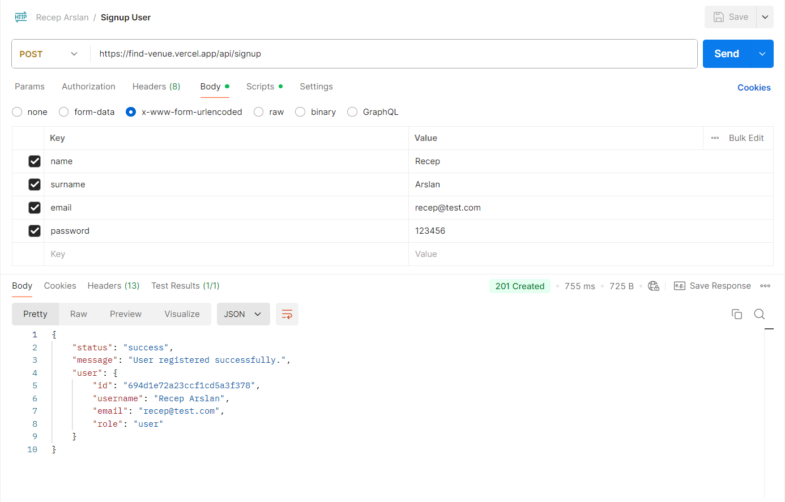 |
| Login User | 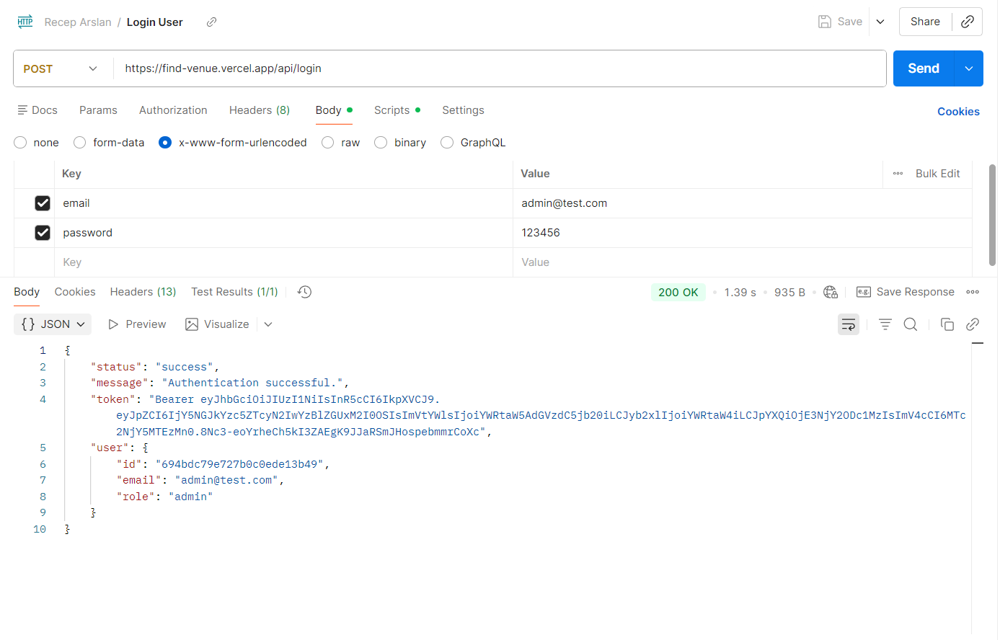 |

#### Venue Tests
| Test | Screenshot |
|------|------------|
| Get All Venues |  |
| Get Venues By Location | 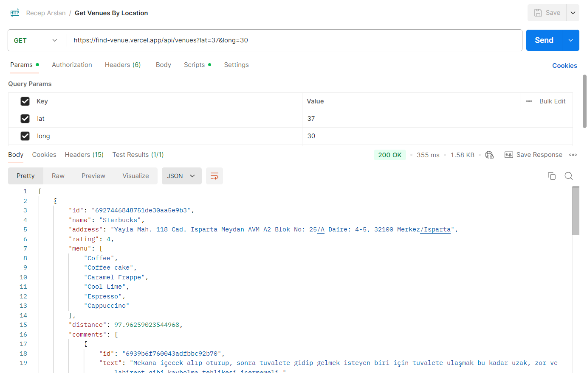 |
| Get Venue By VenueID | 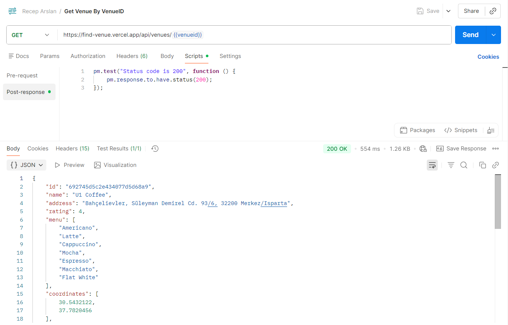 |
| Add Venue | 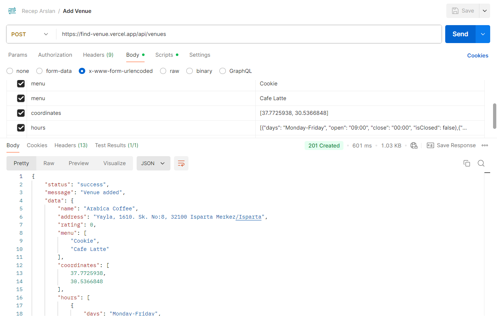 |
| Update Venue By VenueID| 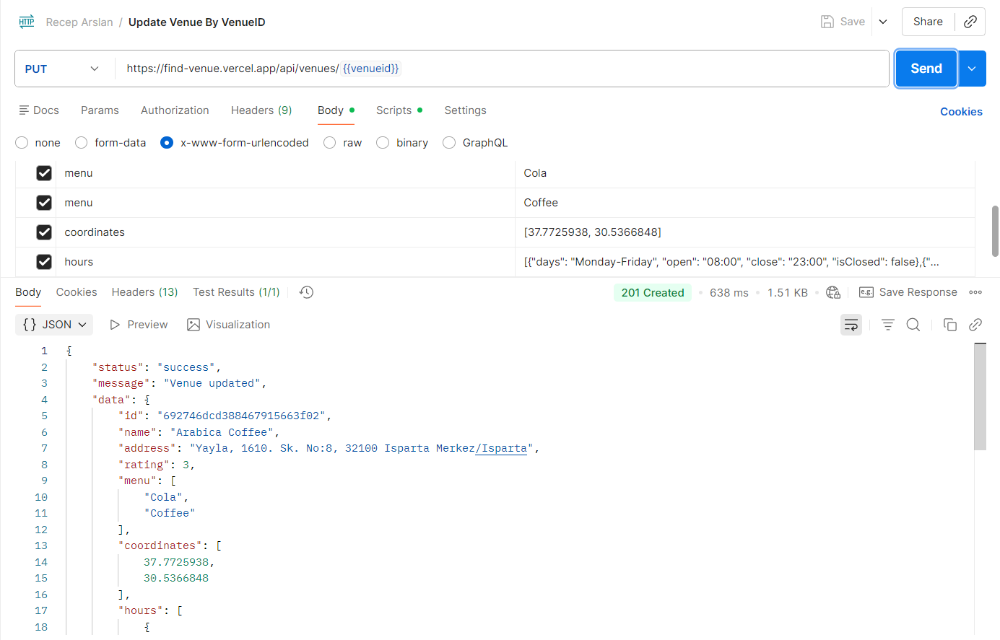 |
| Delete Venue By VenueID| 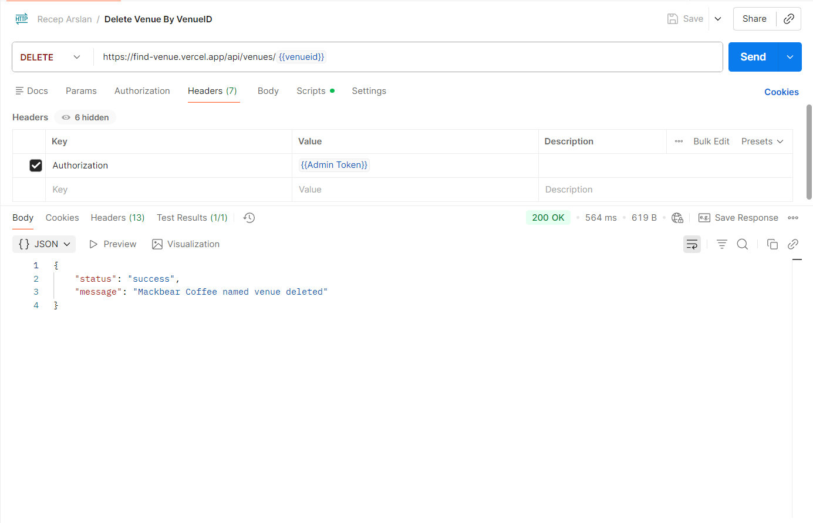 |

#### Comment Tests
| Test | Screenshot |
|------|------------|
| Get Comment By VenueID And CommentID | 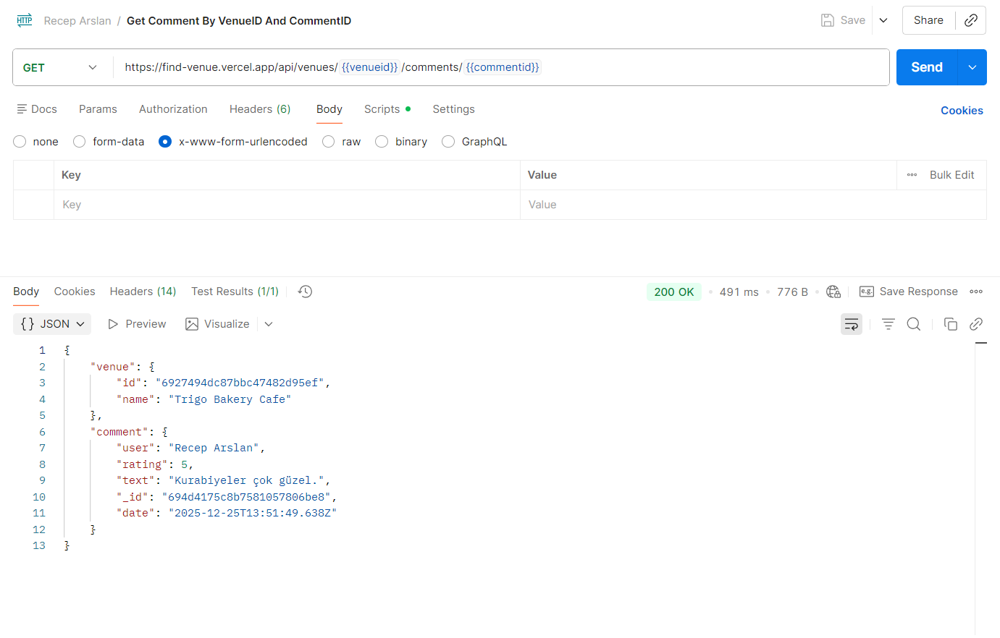 |
| Add Comment By VenueID | 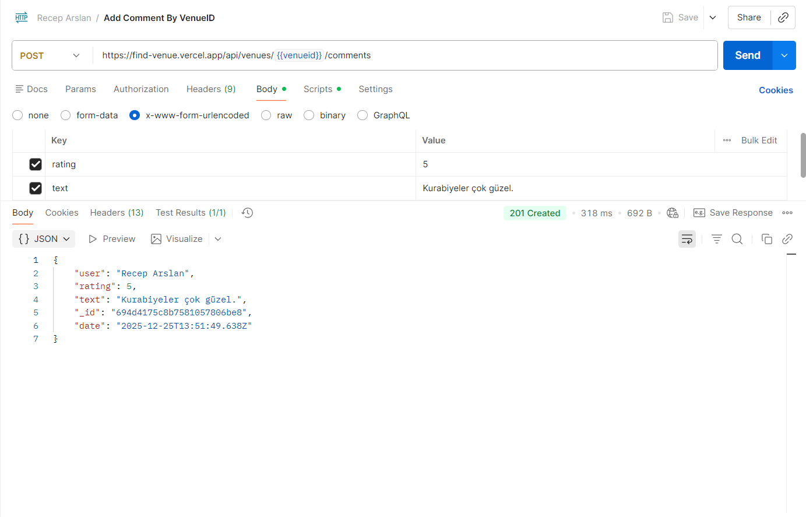 |
| Update Comment By VenueID And CommentID | 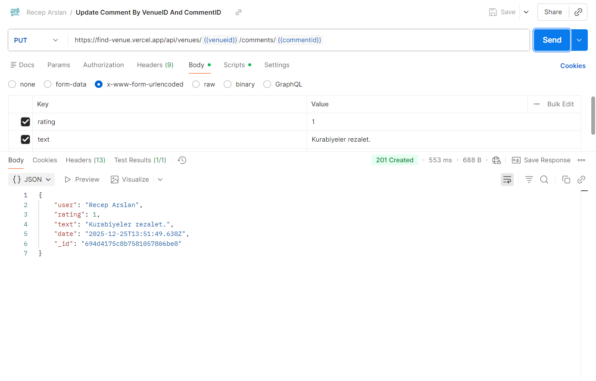 |
| Delete Comment By VenueID And CommentID| 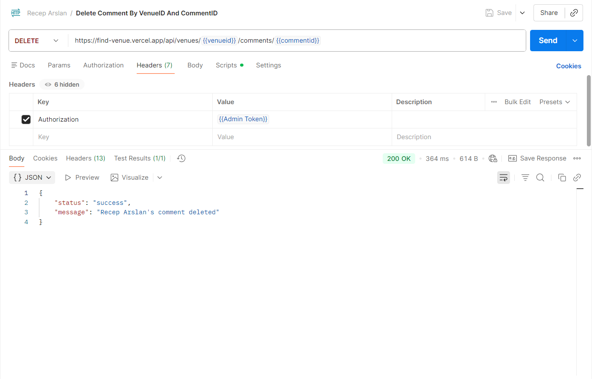 |

---

## 🔧 Installation & Setup

### Prerequisites
- Node.js (v16 or higher)
- MongoDB (local or Atlas)
- npm or yarn

### Backend Setup

1. Navigate to the backend directory:
```bash
cd backend
```

2. Install dependencies:
```bash
npm install
```

3. Create a `.env` file in the backend directory:
```env
MONGODB_URI=your_mongodb_connection_string
JWT_SECRET=your_jwt_secret_key
```

4. Start the server:
```bash
npm start
```

The backend will run on `http://localhost:3000`

### Frontend Setup

1. Navigate to the frontend directory:
```bash
cd frontend
```

2. Install dependencies:
```bash
npm install
```

3. Create a `.env` file in the frontend directory:
```env
VITE_API_URL=http://localhost:3000/api
```

4. Start the development server:
```bash
npm run dev
```

The frontend will run on `http://localhost:5173`

### Building for Production

#### Backend
```bash
cd backend
npm start
```

#### Frontend
```bash
cd frontend
npm run build
npm run preview
```

---

## 📝 Environment Variables

### Backend
| Variable | Description |
|----------|-------------|
| `MONGODB_URI` | MongoDB connection string |
| `JWT_SECRET` | Secret key for JWT token signing |

### Frontend
| Variable | Description |
|----------|-------------|
| `VITE_API_URL` | Backend API base URL |

---

## 📄 License

This project is created as part of a Web Technologies and Programming course assignment.

---

## 👤 Author

**Recep Arslan**

---

Made with ❤️ using React, Node.js, Express, and MongoDB